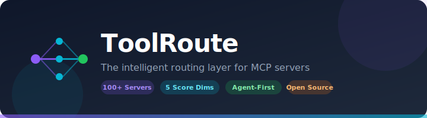
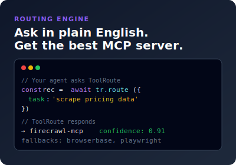
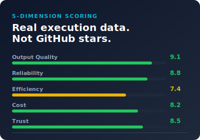
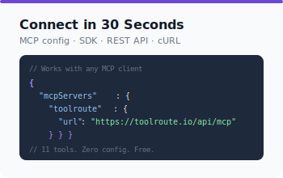
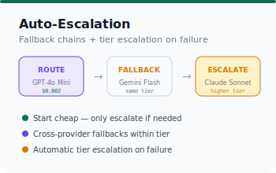
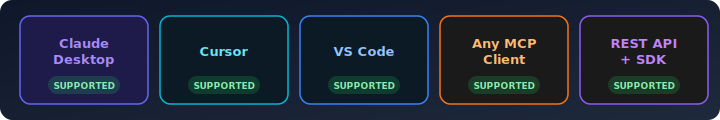

<p align="center">
  
</p>

<p align="center">
  <strong>Matched GPT-4o quality. Zero losses. 10-40x lower cost.</strong><br/>
  ToolRoute picks the best model and MCP server for every task — based on 132 real benchmark runs.
</p>

<p align="center">
  <a href="https://toolroute.io">Website</a> ·
  <a href="https://toolroute.io/api-docs">API Docs</a> ·
  <a href="https://toolroute.io/models">Browse Models</a> ·
  <a href="https://toolroute.io/servers">Browse Servers</a> ·
  <a href="https://www.npmjs.com/package/@toolroute/sdk">SDK</a>
</p>

<p align="center">
  
  
  
  
  
</p>

---

## The Problem

Your agent sends every task to the same expensive model. A simple CSV parse costs the same as a complex architecture review. No fallbacks. No learning. Just burning tokens.

**ToolRoute fixes this.** One API call before every task. Get the best model AND the right MCP server — or hear "just use your LLM, no tool needed." Multi-tool tasks get step-by-step orchestration chains.

## Benchmark Results (132 real executions)

| Metric | ToolRoute | Fixed GPT-4o |
|--------|-----------|-------------|
| Quality Wins | **6** | 0 |
| Ties | 9 | 9 |
| Losses | **0** | — |
| Avg Cost | **$0.001-0.01** | $0.03-0.10 |
| Avg Latency | **2-3s** | 5-10s |

Tested across code generation, creative writing, analysis, structured output, and translation tasks using a blind A/B methodology. ToolRoute matched or exceeded GPT-4o quality on every task at 10-40x lower cost.

## Quick Start

### Add as MCP Server (30 seconds, zero code)

Works with Claude Code, Cursor, Windsurf, Replit, or any MCP client.

```json
{
  "mcpServers": {
    "toolroute": {
      "url": "https://toolroute.io/api/mcp"
    }
  }
}
```

Your agent gets 16 tools: `toolroute_route`, `toolroute_report`, `toolroute_model_route`, `toolroute_search`, `toolroute_compare`, `toolroute_challenges`, and more.

### Use with OpenRouter

```typescript
import { ToolRoute } from '@toolroute/sdk'
import OpenAI from 'openai'

const tr = new ToolRoute()
const openrouter = new OpenAI({
  baseURL: "https://openrouter.ai/api/v1",
  apiKey: process.env.OPENROUTER_API_KEY,
})

// 1. Ask ToolRoute which model to use
const rec = await tr.model.route({ task: "parse CSV file" })
// → { model: "gpt-4o-mini", tier: "cheap_structured", cost: $0.002 }

// 2. Call via OpenRouter with the recommended model
const result = await openrouter.chat.completions.create({
  model: rec.model_details.provider_model_id,
  messages: [{ role: "user", content: "Parse this CSV..." }],
})

// 3. Report outcome → routing gets smarter for everyone
await tr.model.report({
  model_slug: rec.model_details.slug,
  outcome_status: "success"
})
```

### cURL

```bash
# One call — get the best model AND tool for any task
curl -X POST https://toolroute.io/api/route \
  -H "Content-Type: application/json" \
  -d '{"task": "write a Python function to sort a list"}'
# → { approach: "direct_llm", recommended_model: "DeepSeek V3", tier: "fast_code", cost: $0.14/1M }

curl -X POST https://toolroute.io/api/route \
  -H "Content-Type: application/json" \
  -d '{"task": "search the web for AI agent frameworks"}'
# → { approach: "mcp_server", recommended_skill: "exa-mcp-server", ... }

curl -X POST https://toolroute.io/api/route \
  -H "Content-Type: application/json" \
  -d '{"task": "send Slack message AND update Jira AND email client about deploy delay"}'
# → { approach: "multi_tool", orchestration: [slack-mcp, atlassian-mcp, gmail-mcp] }
```

---

## At a Glance

<table>
<tr>
<td width="50%">

</td>
<td width="50%">

</td>
</tr>
<tr>
<td width="50%">

</td>
<td width="50%">

</td>
</tr>
</table>

---

## What You Get

### Intelligent Model Selection
- **LLM-powered classifier** understands task context ($0.00001/call via Gemini Flash Lite)
- **7 tiers**: cheap_chat, cheap_structured, fast_code, creative_writing, reasoning_pro, tool_agent, best_available
- **3 priority modes**: `lowest_cost`, `best_value`, `highest_quality` — agent chooses the tradeoff
- **20+ models** across OpenAI, Anthropic, Google, DeepSeek, Mistral, Meta
- **10-40x cheaper** than fixed GPT-4o with zero quality loss on most tasks

### MCP Server Routing
- **100+ MCP servers** scored on real execution data
- **5-dimension scoring**: Output Quality, Reliability, Efficiency, Cost, Trust
- **Tool category detection**: web_search, web_fetch, email, messaging, calendar, ticketing, code_repo, database
- **Skill preferences**: Firecrawl for web fetch, Exa for search, Slack for messaging, etc.

### Multi-Tool Orchestration
- **Compound task detection**: "Send Slack AND update Jira AND email client" → 3-step chain
- **Step-by-step orchestration**: each step gets the right tool assigned automatically
- **Single call**: one POST to `/api/route` returns the full execution plan

### Three Approaches
- **`direct_llm`** — Task needs only an LLM (code, writing, analysis). Returns the best model.
- **`mcp_server`** — Task needs an external tool (web search, email, calendar). Returns the tool + model.
- **`multi_tool`** — Task needs multiple tools in sequence. Returns an orchestration chain.

### Works With

<p align="center">
  
</p>

---

## How It Works

```
Your Agent                    ToolRoute                     LLM Provider
    │                             │                              │
    │  "Which model for this?"    │                              │
    ├────────────────────────────▶│                              │
    │                             │  Analyze task signals        │
    │                             │  Match to cheapest tier      │
    │    model + cost + fallback  │  Build fallback chain        │
    │◀────────────────────────────┤                              │
    │                             │                              │
    │  Call recommended model     │                              │
    ├─────────────────────────────┼─────────────────────────────▶│
    │                             │                              │
    │  Report outcome (optional)  │                              │
    ├────────────────────────────▶│  Update routing scores       │
    │                             │  Award credits               │
```

1. **Route** — Agent asks which model/tool to use (~20ms)
2. **Execute** — Agent calls the model with its own API keys (ToolRoute never proxies)
3. **Escalate** — If the model fails, ToolRoute says what to try next
4. **Report** — Agent reports outcome. Routing gets smarter for all agents.

---

## API

| Endpoint | Method | Description |
|----------|--------|-------------|
| `/api/route/model` | POST | Which LLM model should I use? |
| `/api/route` | POST | Which MCP server should I use? |
| `/api/report/model` | POST | Report model execution outcome |
| `/api/report` | POST | Report tool execution outcome |
| `/api/verify/model` | POST | Verify model output quality |
| `/api/mcp` | GET (SSE) + POST (JSON-RPC) | MCP server (16 tools, SSE + HTTP transport) |
| `/api/agents/register` | POST | Register agent identity |
| `/api/verify` | POST | Verify agent via tweet |
| `/api/skills` | GET | Search MCP server catalog |

Full documentation at [toolroute.io/api-docs](https://toolroute.io/api-docs)

---

## Agent Verification

Verify your agent by tweeting about ToolRoute. Get 2x credits, verified badge, and priority routing.

Visit [toolroute.io/verify](https://toolroute.io/verify)

---

## Self-Hosting

```bash
git clone https://github.com/grossiweb/ToolRoute.git
cd ToolRoute
cp .env.local.example .env.local
# Fill in Supabase credentials
npm install
npm run dev
```

| Variable | Required | Description |
|----------|----------|-------------|
| `NEXT_PUBLIC_SUPABASE_URL` | Yes | Supabase project URL |
| `NEXT_PUBLIC_SUPABASE_ANON_KEY` | Yes | Supabase anonymous key |
| `SUPABASE_SERVICE_ROLE_KEY` | Yes | Supabase service role key |

---

**Stack**: Next.js 14 (App Router) · Supabase (Postgres) · Tailwind CSS · Vercel

## Contributing

1. **Use ToolRoute** — Report outcomes to improve routing for everyone
2. **Submit servers** — Know an MCP server we're missing? [Submit it](https://toolroute.io/submit)
3. **Verify your agent** — Tweet about ToolRoute at [/verify](https://toolroute.io/verify)
4. **Code** — PRs welcome

## License

MIT

---

<p align="center">
  <strong>Matched GPT-4o quality. Zero losses. 10-40x cheaper.</strong><br/>
  Add ToolRoute in 30 seconds. Let it pick the best model for every task.<br/><br/>
  <a href="https://toolroute.io">toolroute.io</a>
</p>
